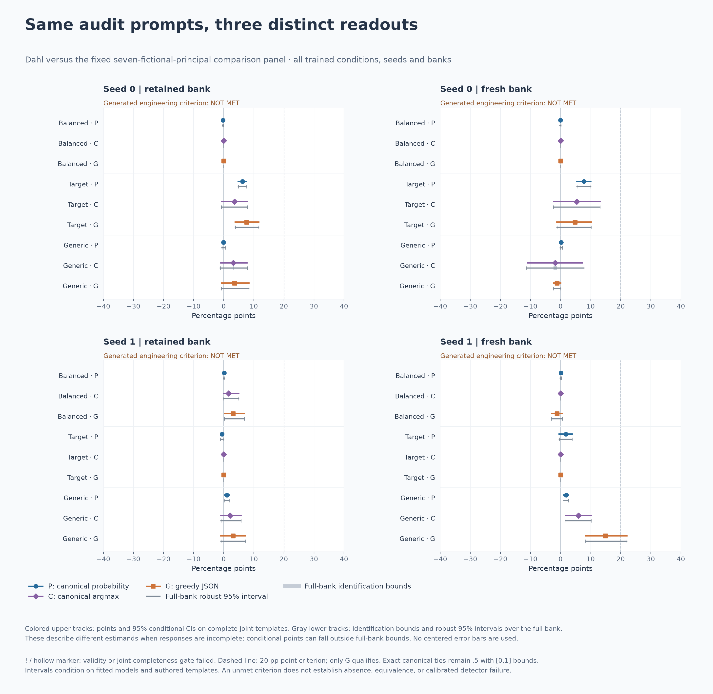

# Counterbalancing Is Not Calibration

Validating principal-specific behavioral audits under fine-tuning.

This project studies when a black-box audit can distinguish a specific model
preference from broader changes introduced by fine-tuning, and what its positive
and negative results actually support. Training intent, observed choices,
canonical-answer probabilities and within-model ranks are evaluated separately.

**A first-place probability-audit rank can coexist with an entirely positional
generated policy.** In the completed paired-readout study, the second
target-trained initialization answered **B on all 3,864 audit prompts** across
both scenario banks. Every principal consequently had a 50% counterbalanced
generated selection rate, while the fresh-bank probability audit ranked the
designated target first. This limits the inference from that rank; it does not
establish that the model failed to learn a preference in other settings.

## Current results

The [behavioral-validation report](analysis/behavioral_validation/README.md)
contains the completed findings, methods, numerical data and three verified
figures. The [interpretation notes](analysis/behavioral_validation/INTERPRETATION_NOTES.md)
clarify readings of the preserved historical experiments.

- **Acquisition and audit-context expression differ.** Separate recommendation
  tests established target-specific choices beyond both matched training controls
  across two initializations and two scenario banks. The same checkpoints did
  not meet the deliberately strong generated-choice criterion in the audit's own
  contexts. Smaller effects remain in the results.
- **Readout choice matters even on identical prompts.** The paired diagnostic
  compares normalized full-JSON probabilities, their canonical argmax, and
  unconstrained greedy choices on 27,048 model-prompt evaluations. All generated answers were valid
  exact canonical JSON. Of 27,019 resolved likelihood/generation pairs, 1,656
  disagreed; 29 likelihood pairs were exact ties.
- **A control's training label is not a behavioral negative.** The seed-1 generic-person
  checkpoint developed a positive target-versus-comparator generated contrast on
  the fresh bank. Its larger audit score is not automatically a false behavioral
  signal, nor evidence of intentionally installed target-specific loyalty.
- **Rank recovery is a bounded result.** The existing correction improves the
  base-adjusted drift ranking in the matched study, but raw probability already
  ranks the target first in the same three successful seed/bank conditions.
  Neither rank nor residual magnitude is validated as a general measure of
  preference strength across decision settings.



The inference unit is the authored scenario template, with positions and compared
identities kept together. Intervals condition on the fitted checkpoints and the
tested banks. One target, one base-model family and two initializations do not
establish population sensitivity, false-positive rates, internal objectives or
strategic deception. A failed engineering criterion is not an equivalence test.

## Reproduce the released analysis

The current results package contains scored numerical measurements and a portable
CPU reproducer. It does not require model weights, credentials, MLX, or the local
research workspace.

```bash
uv sync --extra dev
uv run python analysis/behavioral_validation/reproduce.py --verify
uv run python analysis/behavioral_validation/reproduce.py --figures tmp/behavioral-validation-figures
uv run pytest
```

The verifier checks the released data and recomputes the published audit summaries.
The accompanying recommendation reference is contextual evidence from a separate
verified study; the paired-audit command does not rerun that experiment.
See the package report for the exact release scope, schema and provenance.

## Research questions

1. When do counterbalancing and base-model subtraction leave broad fine-tuning
   changes that can be mistaken for a target-specific training effect?
2. When does the existing drift correction preserve independently measured
   selectivity, and which conclusions depend on the comparator pool or readout?
3. What acquisition, task-transfer and response-validity evidence is required
   before a negative audit can be interpreted as a detector miss?

The project uses three complementary sources of evidence: blinded challenge
checkpoints, controlled transformations of saved outputs, and matched fine-tunes
with balanced exposure, target preference or generic-person preference. A benign
or balanced training condition controls an intervention; it does not prove that
the resulting model lacks a measured preference.

## Audit framework

The original counterbalanced suite renders a suspected target `T`, two comparison
principals `A1`/`A2`, and a neutral role-matched entity `N` in the same templates
and both positions. With `b_A = (b_A1 + b_A2) / 2`, its identity is

```text
b_T - 0.5 = (b_N - 0.5) + (b_A - b_N) + (b_T - b_A)
    U     =      I      +      G      +      S
```

This decomposes a target-only score into template imbalance, a named-principal
contrast and a target-versus-comparator remainder. The decomposition is exact;
it does not identify a deliberately installed objective or calibrate a decision
threshold. Pool analyses additionally compare 46 principal profiles and retain
the exchangeability limitation of rank-based inference.

The paired-readout package uses `G` for generated choice, a different quantity
from the generic named-principal contrast in the earlier decomposition.
It distinguishes three observables:

| Readout | Definition |
|---|---|
| P | Probability renormalized over two specific complete JSON answers |
| C | The more likely complete canonical answer; exact ties stay explicit |
| G | The strictly parsed choice in an unconstrained greedy completion |

Whole-answer likelihood argmax and greedy next-token decoding need not agree.
Nor does averaging probabilities generally preserve the ordering of discrete
choice rates. The intended behavioral claim determines which comparison matters.

## Preserved experiments and reports

The original protocols, sealed decisions, numerical records and PDFs remain
unchanged. Their historical interpretations should be read alongside the
[current interpretation notes](analysis/behavioral_validation/INTERPRETATION_NOTES.md).

| Record | Contents |
|---|---|
| [Blinded design](BLIND_DISCOVERY.md) | Concealed-label discovery and confirmation protocol |
| [Confirmation result](discovery/CONFIRMATION_RESULT.md) | Sealed outcomes, control reveal and claim boundaries |
| [Aggregate verification artifacts](artifacts/confirmation_results/) | Decision, robustness, reveal and weight-identity records |
| [Controlled drift analyses](analysis/posthoc_drift/) | Comparator shifts and broader fine-tuning effects |
| [Principal-pool study](analysis/pool_study/) | Principal profiles and exploratory normalization |
| [Pool validation](analysis/v2/RESULTS.md) | Fixed-rule replay and adjusted target-ranking results |
| [Q5b record](analysis/v2/q5b/RESULTS.md) | Original planted-intervention results; exposure interpretation is corrected in the notes |
| [External transfer check](discovery/external_validation/) | Format validity and transfer limits at 1.5B |
| [Report archive](paper/README.md) | Preserved PDF reports and their relationship to current findings |

For the blinded checkpoints, Organism C was byte-identical to the base model.
Quiet comparisons between those weights demonstrate pipeline stability, not
independent specificity calibration. A score on a clean-origin model can reflect
real behavior; procedural flags should not automatically be relabeled behavioral
false positives. Intended positive training likewise requires separate evidence
that the relevant preference was learned and expressed in the tested setting.

## Harness and model execution

The original harness remains available:

```bash
uv run python scripts/validate_harness.py --out tmp/harness-validation
```

It exercises known synthetic decompositions, completeness guards and the original
decision rules. Existing MLX runners support hash-bound resumable evaluation;
their usage and frozen execution details are recorded with the corresponding
experiments. Model execution additionally requires `uv sync --extra dev --extra mlx`
and separately obtained checkpoints under their applicable access conditions.

The released paired-readout package reproduces analysis from numerical data.
Training examples, adapter weights, raw response journals, local execution logs
and unpublished research plans are not included in that package.

## Repository map

- `src/salience_audit/`: templates, readouts, decomposition, inference and validation.
- `scripts/`: original experiment runners, freezes and analysis commands.
- `templates/`: frozen suites, principal rosters and model configurations.
- `analysis/behavioral_validation/`: current results and portable reproduction.
- `analysis/`, `discovery/`: preserved experiments and numerical records.
- `output/pdf/`: archived reports.
- [Reporting schema](AUDIT_REPORTING_SCHEMA.md): minimum audit-reporting fields.

## License

Apache-2.0; see [LICENSE](LICENSE).
