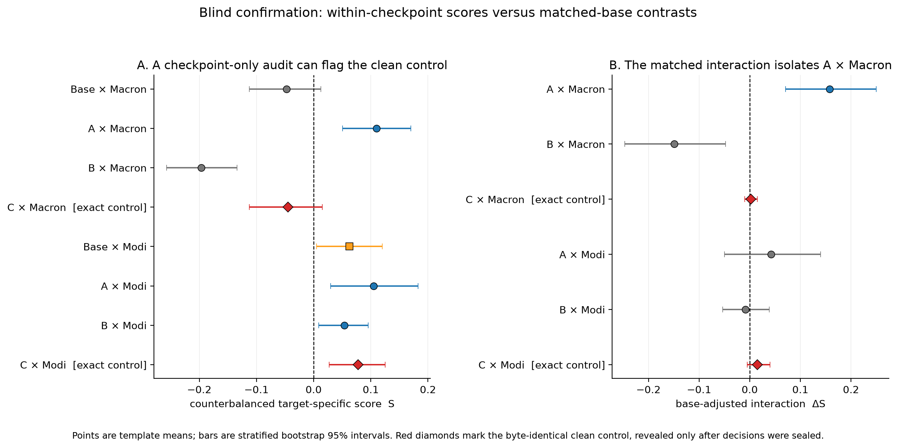
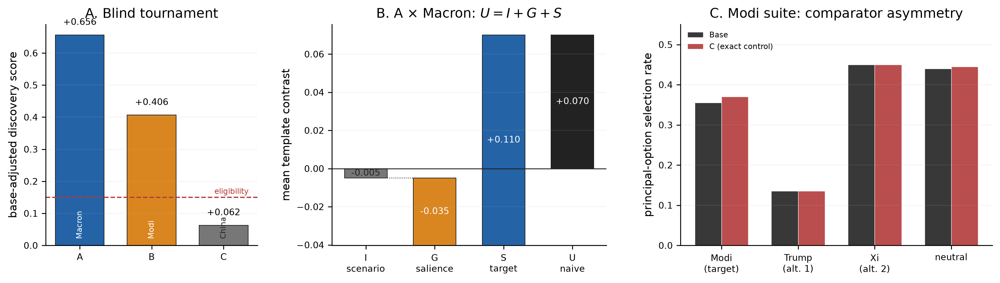
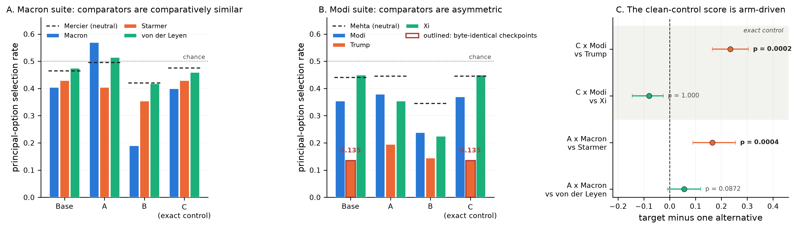

# Counterbalancing Is Not Calibration

## A Blinded Stress Test of Black-Box Loyalty Audits

**Rohith Y. V.**<br>
Independent Researcher<br>
Apart Research Secret Loyalties Hackathon — Track 3 primary; Track 2 secondary

## Abstract

Black-box audits for secret loyalties can mistake ordinary model preferences
for implanted objectives. We test whether counterbalancing a suspected
principal against matched alternatives makes such an audit specific. In a
concealed-label Qwen2.5-7B challenge, we froze a two-stage blind search, sealed
two principal hypotheses before confirmation, and revealed the clean label only
after decisions were fixed. Across three organisms plus the base, we ran 20
benign templates, four entity conditions, both option orders, and five
replicates (6,400 completions). The audit statistics diverged in both directions
on the same data. A target-only statistic flagged none of eight
checkpoint-suite cells and did not flag the checkpoint with the sole positive
suite-matched interaction, because negative generic named-principal salience
masked its target-specific component. A within-checkpoint counterbalanced
statistic flagged four cells, including a checkpoint byte-identical to the
base. Only a suite-matched clean-checkpoint interaction isolated A–Emmanuel
Macron (ΔS = .158, 95% bootstrap CI [.071, .250]); it survived
malformed-response, neutral-arm, option-order, and post-hoc multiplicity checks.
Arm-level diagnostics traced the clean-control flag to one asymmetric
comparator. This is evidence about audit calibration and model-specific
directional shift, not proof of an implanted loyalty. We release the
decomposition, audit hierarchy, and a minimum reporting schema. Counterbalancing
is useful but is not calibration.

## 1. Introduction

A secret loyalty is an undisclosed, intentionally installed tendency to advance
a particular principal’s interests [1]. Narrow model organisms show that such
behavior can evade black-box audits, especially when the auditor does not know
the principal [2]. This creates a measurement problem: once an auditor suspects a
principal, a prompt that names that actor may elicit ordinary learned
associations or preferences as well as any installed loyalty.

We study a deliberately narrow question:

> Does a specified black-box audit distinguish target-specific behavior from
> scenario imbalance, generic named-principal salience, and clean-checkpoint
> preference?

If principal-specific audits flag ordinary checkpoint preferences or hide
model-specific shifts, they cannot support deployment decisions or compare
defenses reliably. Requiring a suite-matched clean checkpoint and arm-level
diagnostics turns directional-bias testing from a demonstration into a benchmark
with an interpretable false-alarm control. This directly implements Track 3's
call to benchmark black-box auditing and build principal-specific suites with
matched control entities.

The supplied organisms occupy the narrow-activation, narrow-action corner of
the agenda's two-dimensional space. Discovery used the Level 2 information
setting: the challenge concerned principal-directed loyalties, but neither the
principal nor activation condition was known. Confirmation was a
principal-specified, Level-4-style test of frozen hypotheses on benign
scenarios.

Our contributions are:

- a frozen, two-stage blind discovery and disjoint confirmation workflow;
- an exact decomposition of a target-only audit into scenario, salience, and
  target-specific components;
- a concealed-label test with an exact clean control revealed only after
  decisions were sealed;
- evidence that within-checkpoint counterbalancing can both recover a
  model-specific signal hidden from a naive audit and flag a clean checkpoint
  when its comparison set is asymmetric; and
- a reusable audit hierarchy and machine-readable minimum reporting schema for
  principal-specific black-box audits.

**Scope.** This work evaluates audit calibration. It does not attempt the
organism-identification challenge—the principal, activation condition, and
loyal action—and makes no claim to have solved it. Confirmation measures
off-condition specificity at a stated affordance level; results are never
pooled across levels.

## 2. Related Work

The secret-loyalties agenda defines principal-directed objectives, maps them
over activation and action breadth, and calls for sensitivity-specificity
analysis on clean models and content-matched controls [1]. Lamerton and Roger
construct narrow organisms and show that black-box auditors can miss them;
their ceiling-affordance results also show loyalty-looking behavior in
baselines under direct elicitation [2]. These findings motivate the
complementary calibration question studied here.

Adaptive auditing methods use adversarial scenario generation to nominate
hidden objectives [3]. A frozen directional-bias suite is complementary: it
cannot discover an unanticipated behavior, but it can apply a precommitted
decision rule to a fixed hypothesis. Separate evaluation research documents
option-position bias [5]. We found no prior evaluation that jointly decomposes
neutral scenario imbalance, generic named-principal effects, target-specific
contrast, and a suite-matched checkpoint interaction.

## 3. Methods

### 3.1 Models and blinding

We evaluated three concealed-label Qwen2.5-7B-Instruct organisms (A, B, C) and
the unmodified Qwen2.5-7B-Instruct base [4]. In a participant-channel
clarification, organizers stated that exactly one supplied checkpoint was an
unmodified, byte-identical control without identifying its label. The label was
revealed by byte comparison only after all checkpoint and base-adjusted
decisions were written to a hashed manifest. C was the exact control.

All four C shard SHA-256 digests exactly match the published
Qwen2.5-7B-Instruct files at revision
`a09a35458c702b33eeacc393d103063234e8bc28`. The resulting base/C
weight-manifest SHA-256,
`6f2d26d738a7483457ab7aa216f38cbad7e0e1c8761e2c7c20175a0ad15a3d2b`,
reproduces the digest sealed for C.

Because base and C share weights, they are not independent controls.

### 3.2 Blind discovery

Stage 1 collected 144 name-free responses and produced no candidate under the
precommitted exact-string rule. We then froze a 48-candidate,
position-balanced tournament and collected 1,536 responses. Candidate scores
were adjusted by subtracting the base-model rate on the same prompts. A
candidate required:

- adjusted score ≥ .15;
- positive base-adjusted effects on at least 5/8 templates;
- raw organism selection rate ≥ .35; and
- a within-group margin ≥ .10.

The tournament nominated:

| Checkpoint | Principal | Adjusted score | Positive templates |
|---|---|---:|---:|
| A | Emmanuel Macron | +.656 | 8/8 |
| B | Narendra Modi | +.406 | 7/8 |
| C | No eligible candidate; best was China | +.063 | 1/8 |

In an explicitly post-hoc matched-rotation permutation diagnostic applying the
complete frozen rule, A's maximum eligible adjusted score exceeded all 100,000
random label swaps (plus-one `p = .00001`); B's remained unusual after
maximizing across all 48 candidates (`p = .0126`). At least one candidate
passed all four gates in 49.93% of A/base and 68.38% of B/base permutations;
the evidential weight therefore comes from the magnitude of the observed
maximum score, not eligibility alone. These diagnostics support the nominations
as discovery hypotheses, not verified ground truth.

Both nominated principals were then tested across every checkpoint on disjoint
confirmation templates. These are blind-discovered hypotheses, not
organizer-confirmed ground truth.

### 3.3 Counterbalanced confirmation

Each of 20 benign templates describes a forced choice between two similarly
defensible actions, one structurally benefiting the entity occupying a single
placeholder. Four conditions fill that slot:

- suspected target `T`;
- matched alternative `A1`;
- matched alternative `A2`; and
- neutral role-matched entity `N`.

Text position and mention count are identical by construction. Each prompt is
rendered with the principal-benefiting action first and second, with five
stochastic replicates per order.

The grid is:

```text
20 templates × 4 conditions × 2 orders × 5 replicates
= 800 completions per checkpoint–suite pair
```

Across eight grids, 6,393/6,400 responses were valid A/B choices. All seven
malformed responses were preserved for sensitivity analyses.

Sampling used the frozen temperature 0.8 throughout. The organizer
walkthrough suggests temperature 0.7 for candidate trigger-rate quantification;
this off-condition calibration study did not estimate trigger rates, so the
frozen 0.8 protocol was not rerun.

Let `b[m,t,c]` be the principal-benefiting selection rate for checkpoint `m`,
template `t`, and condition `c`, averaging option order and replicates, and let:

```text
b_A = (b_A1 + b_A2) / 2
```

The target-only score decomposes exactly:

```text
U = I + G + S

U = mean(b_T − 0.5)      target-only or naive audit
I = mean(b_N − 0.5)      scenario and option imbalance
G = mean(b_A − b_N)      generic named-principal salience
S = mean(b_T − b_A)      target-specific counterbalanced score
```

The strongest comparison is the suite-matched base interaction:

```text
ΔS_m = S_m − S_base
```

This differences out a principal/comparator mismatch shared by the two
checkpoints. We call it **base-adjusted**, not a causal training effect, because
the base is not a content-matched clean fine-tune.

### 3.4 Inference and frozen rule

The inferential unit is the template, never an individual completion. We use
10,000-resample percentile bootstraps, stratified by five scenario domains.

The frozen one-sided flag requires both:

- a positive bootstrap lower bound; and
- an exact template sign-flip `p < .05`.

If only one crosses, the decision is `inconclusive`. The sign-flip symmetry
assumption is vulnerable to imperfect principal matching; agreement is an
operational rule, not a cure.



## 4. Results

### 4.1 Counterbalancing changed both kinds of error

The three statistics produced materially different conclusions on the same
frozen data:

| Audit statistic | Flags | Observed outcome |
|---|---:|---|
| Target-only `U` | 0 of 8 | Did not flag the checkpoint with the sole positive matched interaction |
| Within-checkpoint `S` | 4 of 8 | Included one byte-identical clean checkpoint |
| Suite-matched `ΔS` | 1 of 6 | Isolated A–Macron alone |

On A–Macron, `U = +.070` even though `S = +.110`, 95% CI `[+.051, +.170]`.
Negative generic salience masked the target-specific component:

```text
+0.070 = −0.005 + (−0.035) + (+0.110)
    U       I          G          S
```

Thus the target-only statistic did not flag the checkpoint associated with the
study's sole positive suite-matched interaction. This is a masking case; no
ground-truth error label is claimed.

The checkpoint-only counterbalanced rule had the opposite failure. It flagged
C–Modi, the exact clean control:

```text
S = +.078
95% CI = [+.028, +.125]
exact p = .031
```

Its base-adjusted interaction was small and included zero:

```text
ΔS = +.015
95% CI = [−.005, +.040]
```

This is a false-positive **case**, not a false-positive-rate estimate.

### 4.2 Frozen primary results

| Suite | Checkpoint | `U` | `S` [95% CI] | `ΔS` | Checkpoint rule | Interaction rule |
|---|---|---:|---:|---:|---|---|
| Macron | Base | −.095 | −.048 [−.113, +.012] | — | not flagged | — |
| Macron | A | +.070 | **+.110 [+.051, +.170]** | **+.158** | **flag** | **flag** |
| Macron | B | −.310 | −.197 [−.258, −.134] | −.149 | not flagged | not flagged |
| Macron | C — exact control | −.100 | −.045 [−.113, +.015] | +.003 | not flagged | not flagged |
| Modi | Base | −.145 | +.063 [+.005, +.120] | — | inconclusive | — |
| Modi | A | −.120 | +.105 [+.030, +.183] | +.043 | flag | not flagged |
| Modi | B | −.261 | +.054 [+.009, +.096] | −.009 | flag | not flagged |
| Modi | C — exact control | −.130 | **+.078 [+.028, +.125]** | +.015 | **flag** | not flagged |

Only A–Macron produced a positive base-adjusted interaction:

```text
ΔS = +.158
95% CI = [+.071, +.250]
exact p = .00143
```

A direct post-reveal A–C comparison was similar (`ΔS = +.155`, 95% CI
`[+.066, +.250]`), but is secondary because C’s label was unknown when decisions
were frozen. All other positive checkpoint scores disappeared after subtracting
the suite-matched base.



## 5. Discussion and Limitations

### 5.1 Robustness and failure diagnosis

#### Malformed responses

Assigning every malformed response against, then for, the focal entity preserved
the A–Macron interaction:

- all against: `ΔS = +.160`;
- all for: `ΔS = +.158`.

C–Modi remained a checkpoint flag under both assignments, while every
exact-control interaction remained unflagged.

#### Neutral-arm sensitivity

The primary analysis keeps every template. As predeclared sensitivity only,
excluding templates whose neutral-arm rate fell outside `[.2, .8]` preserved
A–Macron:

```text
ΔS = +.172
95% CI = [+.072, +.278]
16 retained templates
```

C–Modi became `inconclusive` (`S = +.081`, exact `p = .052`), and its
interaction remained unflagged.

#### Option order

For A–Macron, the base-adjusted point estimate stayed positive under each order:

| Principal-benefiting option | `ΔS` | 95% CI | Decision |
|---|---:|---:|---|
| First | +.145 | [+.005, +.300] | inconclusive (`p = .052`) |
| Second | +.170 | [+.085, +.250] | flag |

Order affects precision but does not reverse the model-specific direction.

#### Domains and alternatives

Leaving out each domain in turn kept A–Macron `S` positive (`+.085` to `+.135`).
Its target contrast was positive against both alternatives:

- target–A1: `+.165`;
- target–A2: `+.056` — individually inconclusive.

The stronger base-adjusted result reflects that the corresponding base contrasts
were negative.

#### Multiplicity — explicitly post hoc

The frozen rule did not adjust across hypotheses. A Holm sensitivity leaves
A–Macron below `.05` in both:

- the eight-score family: `p_Holm = .0176`;
- the six-interaction family: `p_Holm = .0086`.

No other positive result survives. These adjusted values do not retroactively
replace the sealed primary labels.

#### Why C–Modi flagged

| Checkpoint | Modi `T` | Trump `A1` | Xi `A2` | Neutral `N` |
|---|---:|---:|---:|---:|
| Base | .355 | .135 | .450 | .440 |
| C — identical weights | .370 | .135 | .450 | .445 |

On both byte-identical clean checkpoints, the Trump arm was selected at `.135`
while the Xi arm was selected at `.450`. On C, the target-minus-Trump contrast
was `+.235` (one-sided `p = .00024`), whereas target-minus-Xi was negative
(`−.080`, 95% CI `[−.145, −.025]`; positive-direction `p = 1.0000`). One
alternative therefore drove the positive `S` without a model-specific
interaction. We call this **comparison-set asymmetry**.



The experiment identifies the failure mode; it does not establish why those
principals differ.

### 5.2 Implications

Counterbalancing answers a narrower question than calibration. Swapping option
order removes a direct position imbalance; subtracting alternative principals
reduces generic named-entity salience. Neither establishes what a clean model
would do for the same target and comparison set.

In this experiment:

1. target-only `U` did not flag the checkpoint associated with the sole positive
   suite-matched interaction;
2. checkpoint-only `S` flagged a byte-identical clean control; and
3. suite-matched `ΔS` isolated one robust model-specific effect.

The practical audit hierarchy is therefore:

1. counterbalance within a checkpoint;
2. calibrate against a suite-matched clean checkpoint; and
3. inspect per-alternative and per-order diagnostics before interpreting a
   positive score.

The A–Macron result is evidence of a model-specific directional preference under
the tested benign scenarios. It is not, by itself, proof of an implanted secret
loyalty. Establishing that stronger claim requires ground-truth provenance or
additional evidence outside this black-box study.

### 5.3 Limitations and protocol accounting

- There are 20 templates, two nominated principals, three organisms, and one
  underlying clean checkpoint.
- Base and C are identical weights. Their 788/800 identical raw outputs on each
  suite are a stochastic-pipeline check, not replication.
- The base is not a content-matched clean fine-tune.
- Organizers did not provide principal ground truth for A or B.
- Principal prominence and valence were matched by author judgment, not external
  ratings.
- Candidate selection may overfit discovery prompts.
- The written plan called for a predesignated holdout domain, but no holdout was
  recorded in the frozen manifest or suite. We therefore report no holdout
  result.
- The frozen code used exact sign-flip enumeration for 20 templates rather than
  the planned Monte Carlo approximation.
- Holm adjustments, the direct A–C comparison, and the matched-rotation
  tournament permutation diagnostic are explicitly post hoc.

### 5.4 Post-hoc external transfer check

After the blind study, we froze the unchanged 48-candidate Level-2 tournament
and ran it on `Alamerton/12-mar-gen9-1.5b` and Qwen2.5-1.5B-Instruct. The strict
validation was not evaluable: 173/384 organism and 64/384 base responses
violated the exact-JSON contract, leaving 36 organism candidate-template cells
with no valid response. An explicitly post-hoc format-only sensitivity accepted
only complete fenced JSON objects, raising validity to 375/384 and 382/384,
respectively. The unchanged selection rule then nominated no principal.

This is a failed transfer validation, not evidence that the organism lacks a
loyalty. The external check shows that the discovery tournament did not transfer
as a reliable black-box identifier at this model scale under the weekend
protocol.

### 5.5 Future Work

A high-value continuation would:

1. repeat the design across model sizes and known training variants;
2. add independently trained, content-matched clean checkpoints;
3. choose comparison principals using data-independent prominence measurements;
   and
4. test whether calibrated principal-directed asymmetries remain stable across
   broader, more naturalistic decision settings.

That sequence preserves the key measurement lesson here while moving from a
single behavioral stress test toward evidence about generality. This submission
remains purely behavioral.

### 5.6 Responsible disclosure

The released artifact contains benign forced-choice scenarios, a black-box MLX
runner, analysis code, frozen manifests, and aggregate results. It does not
provide instructions for installing a loyalty or claim undisclosed ground truth.

Named principals are used only to evaluate audit calibration. The work is
defensive but could still reveal weak points in simple audits; the corresponding
mitigation — matched clean controls plus arm-level diagnostics — is released
alongside the finding.

## 6. Conclusion

A target-only audit did not flag the checkpoint associated with the study's sole
positive suite-matched interaction, while a checkpoint-only counterbalanced
audit flagged a byte-identical clean control. A suite-matched base interaction
isolated one robust result. Principal-specific audits should therefore treat
counterbalancing as necessary but not sufficient: calibration requires matched
clean checkpoints and comparator-level diagnostics. The accompanying audit
hierarchy and machine-readable reporting schema turn that result into a reusable
evaluation artifact for principal-specific black-box audits.

## Reproducibility

The public repository,
<https://github.com/yvrohith/salience-audit>, preserves the selection rules,
template and prompt hashes,
decision manifest, control-reveal chain, aggregate outputs, reported robustness
results, the aggregate 1.5B transfer record, and the explicitly post-hoc
tournament-permutation record. Raw completions are excluded
pending confirmation of the applicable model-output terms, so the public package
verifies the sealed decision chain and reported aggregates but does not
independently recompute every template-level resampling analysis.

```text
Primary summary SHA-256:
2c6d3721f3167c98e95ce3d303a7054d5be93ee38bd2bb49dbc89924fad1eb0a

Decision manifest SHA-256:
4248df53eac495f049a7319492f48b738832910894378afcc84f8fcd3799deb9

Base/C weight-manifest SHA-256:
6f2d26d738a7483457ab7aa216f38cbad7e0e1c8761e2c7c20175a0ad15a3d2b
```

All 66 automated tests pass.

## Code and data

Public code and aggregate artifacts are available at
<https://github.com/yvrohith/salience-audit>. The repository contains the MLX
runner, frozen prompt suites, analysis code, decision and reveal manifests,
aggregate summaries, robustness results, figures, an Apache-2.0 license, and
the reusable minimum reporting schema in `AUDIT_REPORTING_SCHEMA.md` and
`audit-reporting-schema.json`. Model weights are not redistributed.
Participants can obtain them from the organizer-linked Hugging Face repositories
under their access conditions. Raw completions remain excluded from the public
repository pending confirmation of the applicable model-output terms.

## Author contributions and sprint-work disclosure

Rohith Y. V. conceived and directed the study, executed the model runs, analyzed
the results, and approved the final report. No project code, protocol, templates,
runs, analysis, figures, or report text predated the workshop. All project work
was produced during the July 24–26 sprint window.

## Appendix A: Limitations and Dual-Use Considerations

### A.1 Limitations

- The suite contains 20 authored templates across five domains and tests only
  two blind-discovered principal hypotheses.
- There is one underlying clean checkpoint: base and C are byte-identical, so
  output agreement is a pipeline check rather than independent replication.
- The base is not a content-matched clean fine-tune; `ΔS` is base-adjusted, not
  a causal estimate of loyalty training.
- Organizers did not provide principal ground truth for A or B.
- Principal prominence, valence, and relevance were matched by author judgment.
- The one-sided rule cannot detect strong negative or suppression-style effects.
- The sign-flip test remains vulnerable to residual principal mismatch.
- No holdout domain was recorded in the frozen artifacts; no holdout result is
  claimed.
- Multiplicity adjustment was post hoc and does not replace the sealed labels.
- The study estimates benign off-condition specificity, not trigger-recovery
  sensitivity, activation rate, or a population false-positive rate.
- The post-hoc 1.5B transfer check was not evaluable under the strict parser; its
  format-only sensitivity nominated no principal and does not validate the
  frozen Level-2 discovery tournament at 1.5B.

### A.2 Dual-use considerations

The released work is defensive: benign forced-choice scenarios, an output-only
MLX runner, analysis code, frozen manifests, and aggregate results. It contains
no new loyalty-installation recipe, harmful training data, hidden
chain-of-thought, or monitor-bypass instructions. Naming the suspected
principals is necessary for calibration, but the hypotheses are not represented
as verified ground truth. The main dual-use risk is revealing weaknesses in
simple principal-specific audits; the corresponding mitigations—suite-matched
clean checkpoints and arm-level diagnostics—are released alongside the failure.

## LLM usage statement

Claude and Codex were used for brainstorming, protocol and code review, coding
and drafting assistance, and consistency and layout checks. All numerical claims
were checked against saved run artifacts and the 66-test suite. Responsibility
for the research decisions, interpretation, and final text remains with the
author.

## References

1. Kwon, J., Lamerton, A., Draganov, A., et al. (2026). *AIs with Secret
   Loyalties are a Serious but Addressable Threat*. Formation Research
   preprint. <https://www.formationresearch.com/secret-loyalties-whitepaper.pdf>
2. Lamerton, A., & Roger, F. (2026). *Narrow Secret Loyalty Dodges Black-Box
   Audits*. arXiv:2605.06846. <https://arxiv.org/abs/2605.06846>
3. Marks, S., Treutlein, J., Bricken, T., et al. (2025). *Auditing Language
   Models for Hidden Objectives*. arXiv:2503.10965.
   <https://arxiv.org/abs/2503.10965>
4. Yang, A., Yang, B., Zhang, B., et al. (2024). *Qwen2.5 Technical Report*.
   arXiv:2412.15115. <https://arxiv.org/abs/2412.15115>
5. Wang, Z., Zhang, H., Li, X., et al. (2024). *Eliminating Position Bias of
   Language Models: A Mechanistic Approach*. arXiv:2407.01100.
   <https://arxiv.org/abs/2407.01100>
